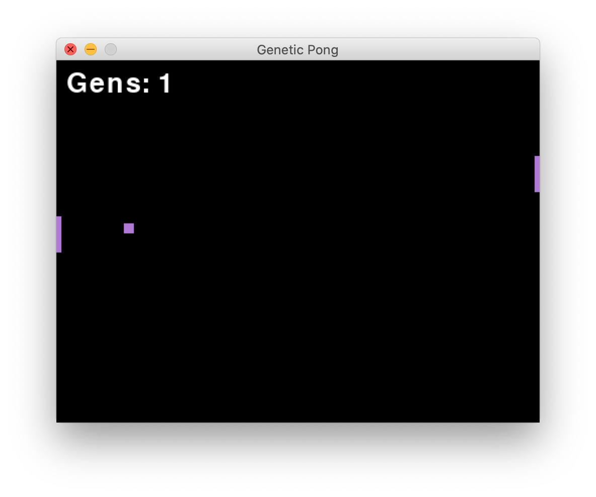
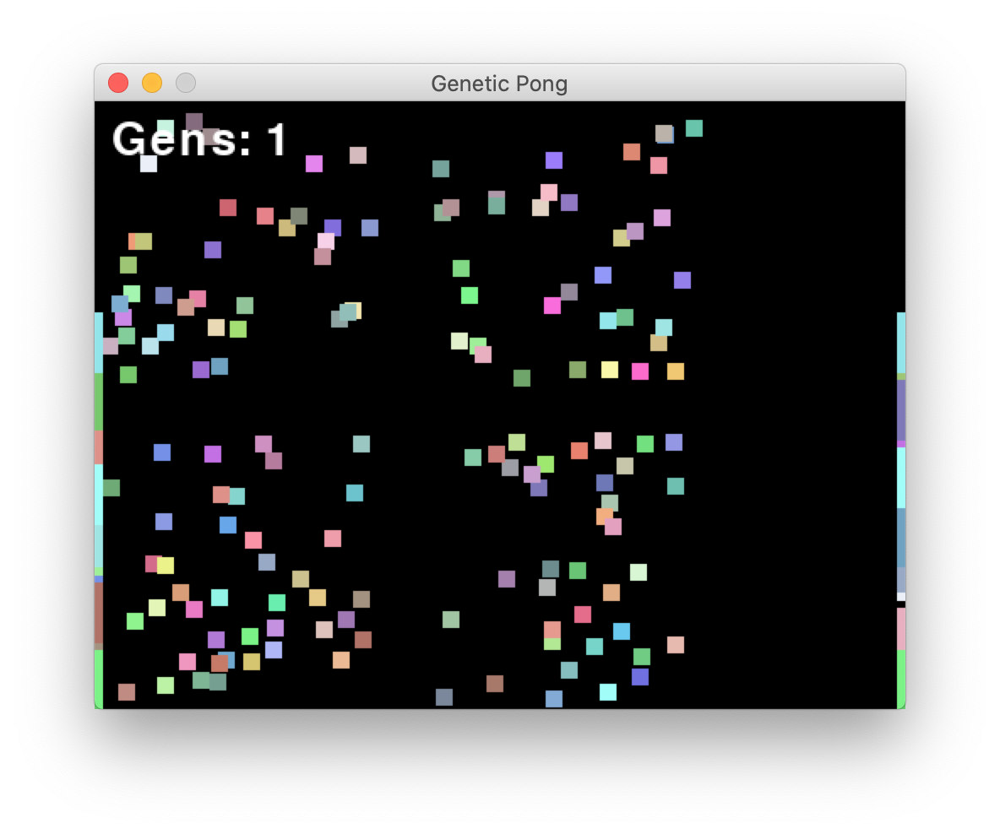

# NEAT Pong
Neat pong is a program that teaches AIs how to play pong using Neural Evolution of Augmenting Topologies a genetic evolution approach to Machine Learning.

## Getting Started
1. To install first clone the repository
2. Check that you have python 3.x
3. run "pip install -r requirements.txt" or "pip3 install -r requirements.txt" if on mac in your terminal or command prompt
4. run the file like any other python script "python3 pong.py" and enjoy!

## How it works
The algorithm has multiple models separated into different "species" in a population. The population is then put into pong and rated on how well they do each generation. The models are given points or fitness every time they hit the ball and every frame they are alive. The model can die if it misses the pong ball and no longer will receive fitness for that generation. The best performing models of each specie will be breaded and create the models for the next generation. The environment will keep running generations until one of the models hits a threshold of fitness at which point it will end and return the model.

The environment is run with 150 different models at once separated into different species based on their neural network structures. One models has two paddles, a left and right, and a ball, and all be in one distinct color and will look like such: 

When all the models are training at once it looks like such:

A little chaotic!

Here it is in action:

## Acknowledgements
I am using the neat-python module. You can find their module and repository [here](https://github.com/CodeReclaimers/neat-python)

Additional reading about neat can be find [here](http://www.cs.utexas.edu/~ai-lab/pubs/stanley.gecco02_1.pdf) from Kenneth O. Stanley's paper.

